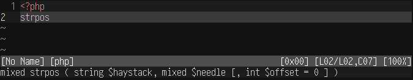

# vim-phpbuiltin-lookup

Plugin to look up function signatures of built-in php functions, and display them on the cmd line.

## Requirements

* Python 2.7 or 3
* curl

## Setup

1. Run `make`
   (Downloads php documentation and generates function list from that)

2. Ready for use.

## Settings

`g:phpBuiltinLookup_map_keys` map keys automatically or not (Default: `1`)
`g:phpBuiltinLookup_map_prefix` prefix for key mappings (Default: `<leader>`)

## Commands

`:PHPBuiltinLookup` Performs the function lookup, can be used to define custom mappings.

## Default keybindings

`<leader>u` in normal/insert mode performs a lookup.

# Screenshot

# TODO

* Support class methods (Without class detection)
